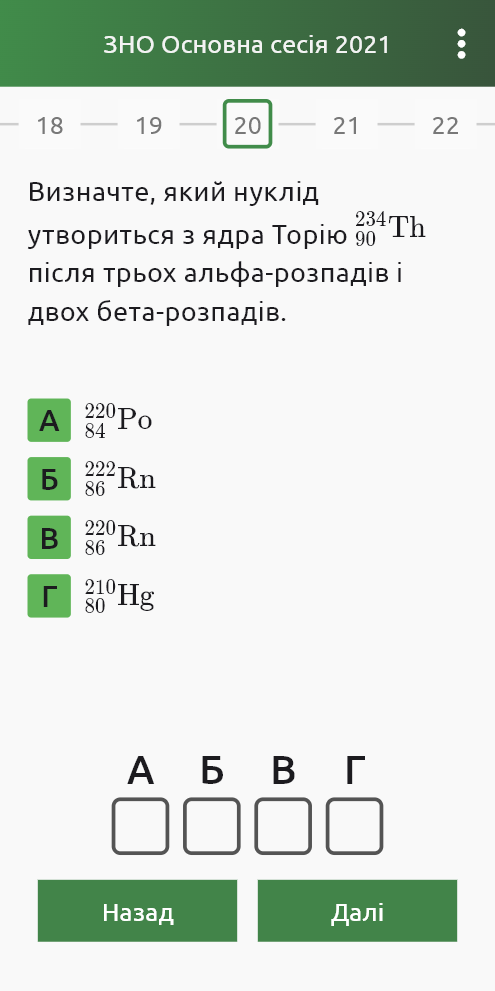

# zno_client

A mobile application meant to help ukrainian high schoolers and students prepare for "ЗНО" exams.
"ЗНО" exams are state certifications held in Ukraine every year, 
the results of these exams define a student's rating when entering a higher education institution.

This application provides students with tests that were used during exams in previous years.
By passing those tests from previous years, students can effectively prepare for the upcoming exams. 

    
    
    
    

Find it on [Play market](https://play.google.com/store/apps/details?id=com.velvit.zno_client)
